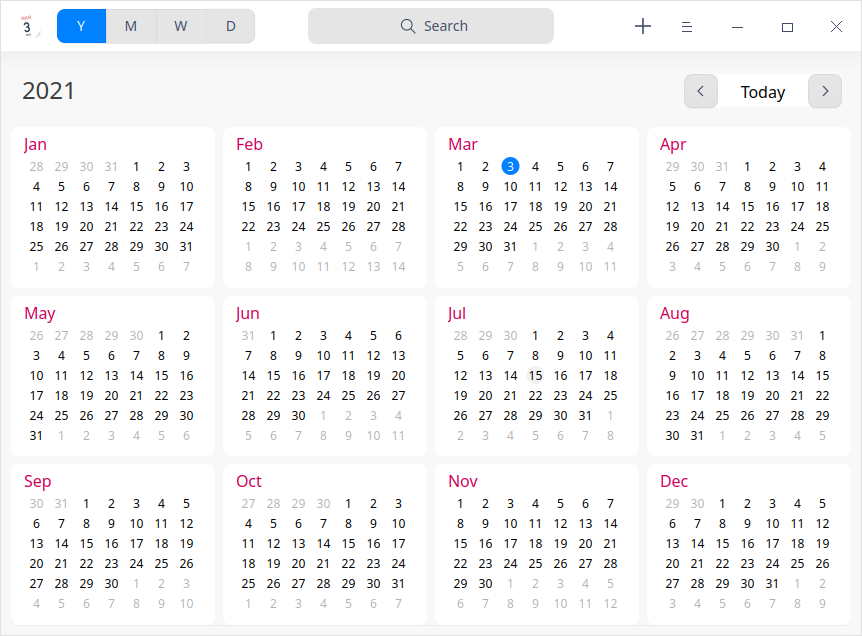
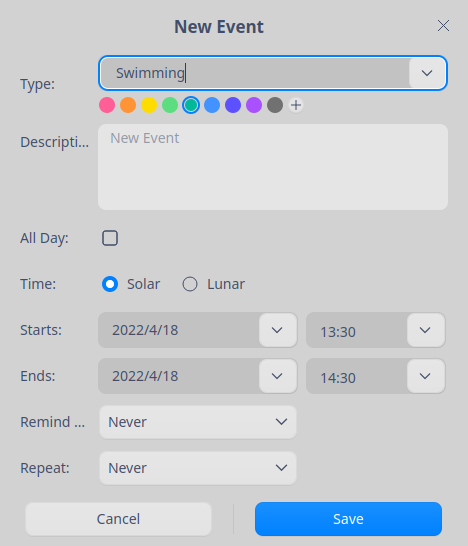
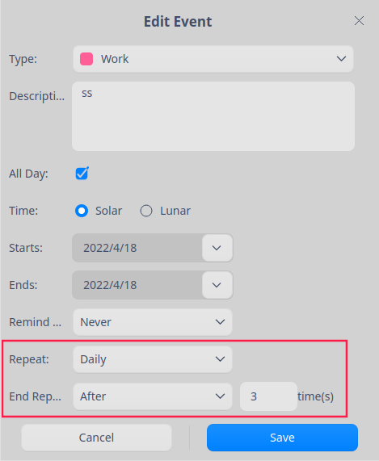
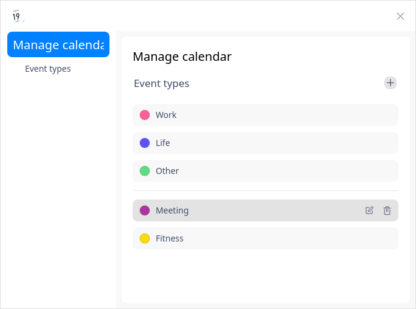

# Calendar|dde-calendar|

## Overview

Calendar is a useful tool to manage your personal life. By relating events with specific time, it allows you to keep records and make plans for your schedule.

## Guide

You can run, close or create a desktop shortcut for Calendar by the following ways.

### Run Calender

1.  Click the Launcher icon  in the Dock to enter the Launcher interface.
2.  Locate Calendar  by scrolling the mouse wheel or searching "calendar" in the Launcher interface and click it to run.
3.  Right-click  and you can:

   - Click **Send to desktop** to create a desktop shortcut.
   - Click **Send to dock** to fix it in the Dock.
   - Click **Add to startup** to add the application to startup and it will automatically run when the system starts up.

### Exit Calendar

- On the Calendar interface, click  to exit calendar.
- Right-click  in the Dock and select **Close All** to exit.
- Click  on the Calendar interface and select **Exit** to exit.

### View Shortcuts

On the Calendar interface, press **Ctrl + Shift + ?** on the keyboard to view shortcuts. Proficiency in shortcuts will greatly improve your efficiency.

## Operations

Calendar can be divided into yearly view, monthly view, weekly view and daily view.

Monthly view is defaulted and you can click to switch between different views.

- Lunar calendar dates will only be displayed in the Chinese system in paring with the solar calendar dates.
-  The date starts from the year **1900** and you cannot view dates earlier than that year during date switching. 
- In the monthly and weekly view, the display of Saturday and Sunday is different from that of days between Monday to Friday. 

>  Notes: Monday is displayed as the first day of a week by default and you can change the display order of a week as needed in **Control Center** > **Date and Time** > **Time Format**.

<table border="1">
<tr>
   <th width="110px">VIEW</th>
   <th width=“200px”>DESCRIPTION</th>
</tr>
<tr>
   <td>Yearly View</td>
   <td>Display the months and days of the whole year.</td>
</tr>
<tr>
   <td>Monthly View</td>
   <td>Display the days and schedule of the month.</td>
</tr>
<tr>
   <td>Weekly View</td>
   <td>Display the days and schedule of the week.</td>
</tr>
<tr>
   <td>Daily View</td>
   <td>Display the detailed schedule arrangements.</td>
</tr> 
</table>

### Create Events

1. You can create events in one of the following ways:
   - Click the  icon in the menu bar on the calendar interface.
   - Double-click, or right-click to select **New event** in the blank area  in the monthly, weekly or daily view.
    - Click and drag the mouse in the monthly, weekly or daily view.
2. Set the event type, description, time, reminder, etc. in the pop-up **New Event** dialogue.

   
   &nbsp;&nbsp;&nbsp;&nbsp;&nbsp;&nbsp;&nbsp;&nbsp;&nbsp;&nbsp;&nbsp;&nbsp;&nbsp;

<table border="1">
<tr>
   <th width="50px">Parameter</th>
   <th width="200px">Description</th>
</tr>
<tr>
   <td>Type</td>
   <td>There are three event types, namely "Work", "Life" and "Other" by default. You can also customize your event type.
       <ol><li>Select  <b>New event type</b> from the Type dropdown list.</li>
          <li>The Type field become editable. Input the type name and set the color.</li></ol>
       You can add, edit or delete the custome type by the <b>Manage</b> option in the main menu. Please refer to the <b>Manage</b> section in <b>Main Menu</b> for details.</td>
</tr>
<tr>
   <td>Description</td>
   <td>Input the description information of the event.</td>
</tr>
<tr>
   <td>Event time</td>
   <td>Set the time properties for the event.
   <ul>
       <li>All day<ul> <li>Check <b>All Day</b>: Only dates can be selected as starts and ends. </li>
   <li>Uncheck <b>All Day</b>: Hours and minutes are available for starts and ends as well except for dates.</li>
           </ul></li>
   </ul>
   <ul>
     <li>Time<ul>  <li>Soloar: Starts and ends are displayed in solor time only.</li>
   <li>Lunar: Starts and ends are displayed both in solor time and lunar time.</li>
         </ul></li>
   </ul>  </td>
</tr>
<tr>
   <td>Reminder</td>
   <td>
Options for <b>Reminde Me</b> with <b>All Day</b> checked: Never, On start day (9:00 AM), 1 day before, 2 days before and 1 week before. 
Options for <b>Reminde Me</b> with <b>All Day</b> unchecked: Never, At time of event, 15 mins before, 30 mins before, 1 hour before, 1 day before, 2 days before, 1 week before.</td>
</tr>
<tr>
   <td>Repeat</td>
   <td>
Options for <b>Repeat</b> with <b>Solar</b> checked: Never, Daily, Weekdays, Weekly, Monthly, Yealy. 
Options for <b>Repeat</b> with <b>Lunar</b> checked: Never, Monthly, Yearly.</td>
</tr>
<tr>
   <td>End Repeat</td>
   <td>Only when you enable the <b>Repeat</b> feature, can <b>End Repeat</b> be displayed. The options for <b>End Repeat</b> are Never, after n time(s) or on the date selected. </td>
</tr> 
</table>

3. Click **Save** to create the event. 

### Edit Events

1. Double-click or right-click a date with schedule in the monthly, weekly or daily view.
2.  Select **Edit** and the **Edit Event** dialogue will pop up.
3.  Set properties for the event under editing.  
4.  Click **Save**. 
5.  If it is set as an all-day event or a repeated event, a prompt box will pop up for you to confirm information and then complete editing. 

> Notes: You can drag the event label created to a specified time or date to change its starts and ends.

During event editing, different prompt information will be displayed according to the changes of content. Description of icons contained in the prompt information is listed as below.

<table border="1">
<tr>
   <th width="130px">ICON</th>
   <th width=“200px”>Description</th>
</tr>
<tr>
   <td>All</td>
   <td>Only effective for the changes of relevant repeating events. </td>
</tr>
<tr>
   <td>Only This Event</td>
   <td>Only effective for the current event modification.  </td>
</tr>
<tr>
   <td>All Future Events</td>
   <td>All the future events on and after the selected date will be changed and the events before the selected date will remain unchanged.</td>
</tr>
<tr>
   <td>Change All </td>
   <td>All repeating events will be changed.</td>
</tr> 
</table>

### Set All-day or Multiple-day Events

Set the **Starts** and **Ends** and you are able to set an all-day or consecutive multiple-day events when creating or editing an event.

### Set Repeating Events

1. Click the drop-down list on the right of **Repeat** and select an option as needed when creating or editing an event.
2.  Click the drop-down list on the right of **End Repeat** and select the end time of the schedule.

### Search Events

1.  In the top search box of the Calendar interface, you can clickto enter keywords.

2.  Press the **Enter** key on the keyboard for searching.
   
3.  Click  or delete the entered information in the search box to clear the current keywords or cancel the search. 

### View Events

Double-click an event title in the monthly, weekly or daily view and the **My Event** window will pop up. You can view events, [Edit Events](#Edit Events) or [Delete Events](#Delete Events). 

### View Schedule Reminder Details

Click the notification prompt box to view the schedule reminder details after the system sends out a notification.

Description of icons contained in the prompt information is listed as below.

<table border="1">
<tr>
   <th width="130px">ICON</th>
   <th width=“200px”>DESCRIPTION</th>
</tr>
<tr>
   <td>Remind me later</td>
   <td>The reminder is set on the current day. After the first reminder is given, click <b>Remind me later</b> and you will be reminded 10 minutes later. The following reminder intervals will be increased by 5 minutes each time on the basis of the last reminder internal when you click <b>Remind me later</b>.  You can also choose 15mins later, 1 hour later, 4 hours later or Tomorrow from the <b>Remind me later</b> dropdown list. </td>
</tr>
<tr>
   <td>Remind me tomorrow</td>
   <td>The reminder is set to one day or two days ahead of the schedule. </td>
</tr>
<tr>
   <td>One day before start </td>
   <td>The reminder is set to one week ahead of the schedule.</td>
</tr>
<tr>
   <td>Close</td>
   <td>Turn off the prompt information.</td>
</tr> 
</table>

### Delete Events

1.   Double-click or right-click a date with event in the monthly, weekly or daily view.
2.  Click **Delete** and a **You are deleting an event** prompt box will pop up.
3.  Confirm the prompt information and delete the event.

Description of icons contained in the prompt information for repeating and non-repeating events when you are deleting an event is listed as below.

<table border="1"><tr>   <th width="130px">ICON</th>   <th width=“200px”>DESCRIPTION</th></tr><tr>   <td>Delete</td>   <td>Delete non-repeating events. </td></tr><tr>   <td>Delete All</td>   <td>Delete all occurrences of this event.</td></tr><tr>   <td>Delete Only This Event </td>   <td>Delete only the selected occurrence of the event. This is only applicable to the repeating events.</td></tr><tr>   <td>Delete All Future Events</td>   <td> Delete this occurences and all future occurrences of the event but the occurrences of the event before the selected date will be retained. This is only applicable to the repeating events.</td></tr> </table>

   

## Main Menu

On the main menu, you can manage the event type, switch window themes, view the help manual and get more information about Calendar.

### Manage
#### Manage Event Types

Click  > **Manage**  on the Calendar interface to enter the Manage Calendar interface. You can add, edite or delete the custom event type.

**Add An Event Type**

1. Click  on the Manage Calendar interface.
2. Input the name and set the color for the event type in the pop-up **New event type** dialogue.
3. Click **Save**.

**Edit An Event Type**

1. Select a custom event type on the  on the Manage Calendar interface.
1. Click .
2. Input the name and set the color for the event type in the pop-up **New event type** dialogue.
3. Click **Save**.

**Delete An Event Type**

1. Select a custom event type on the  on the Manage Calendar interface.
2. Click to delete the event type.

### Theme

There are three window themes, namely Light Theme, Dark Theme and System Theme.

1.  Click  on the Calendar interface.

2.  Click **Theme** to select one theme.

### Help

1.  Click  on the Calendar interface.
2.  Click **Help** to view the manual of Calendar.

### About

1.  Click  on the Calendar interface.
2.  Click **About** to view the version and introduction of Calendar. 

### Exit

1.  Click  on the Calendar interface.
2.  Click **Exit** to exit Calendar.

