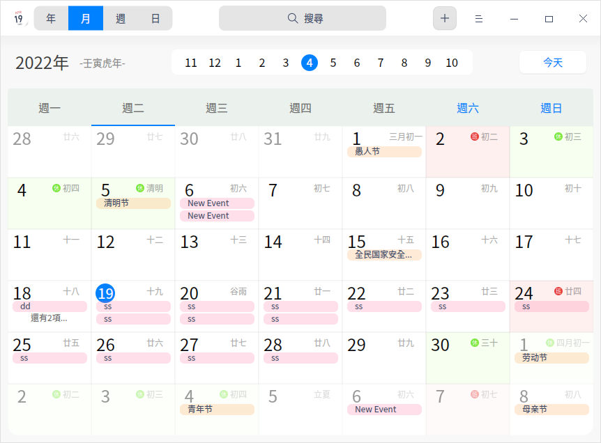
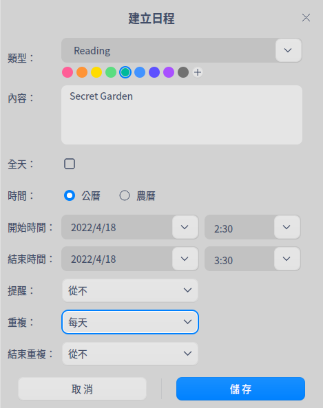
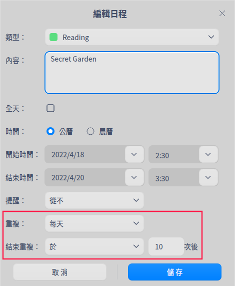
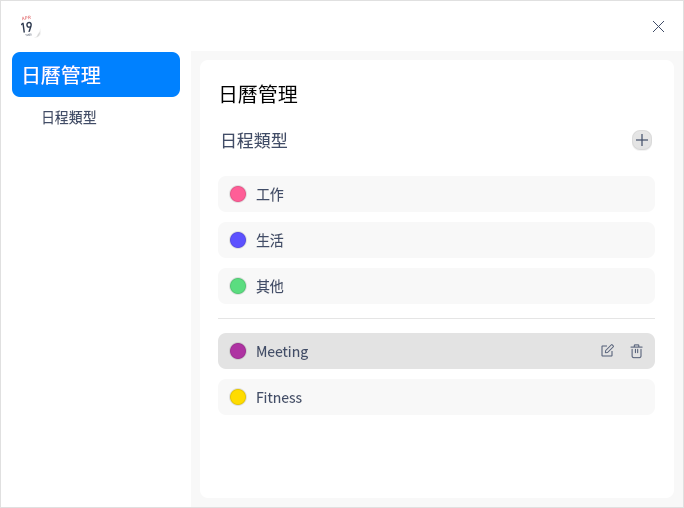

# 日曆|dde-calendar|

## 概述

日曆是一款查看日期、管理日程的小工具，支援查看農曆、黃曆、節氣和常見的節日訊息等，內建日程提醒功能幫您更好地規劃時間。

## 使用入門

透過以下方式執行或關閉日曆，或者建立日曆的捷徑。

### 執行日曆

1. 單擊任務欄上的啟動器圖示  ，進入啟動器介面。
2. 上下滾動滑鼠滾輪瀏覽或透過搜尋，找到日曆圖示  ，單擊執行。
3. 右鍵單擊 ，您可以：

   - 單擊 **建立桌面捷徑**，在桌面建立捷徑。
   - 單擊 **釘選到Dock**，將應用程式固定到Dock。
   - 單擊 **開機啟動**，將應用程式添加到開機啟動項，在電腦開機時自動執行該應用。

### 關閉日曆

- 在日曆介面單擊 ，關閉日曆。
- 在任務欄右鍵單擊 ，選擇 **全部關閉**，關閉日曆。
- 在日曆介面單擊 ，選擇 **退出**，關閉日曆。

### 查看快捷鍵

在日曆介面上，使用快捷鍵 **Ctrl + Shift + ?** 打開快捷鍵預覽介面。熟練地使用快捷鍵，將大大提升您的操作效率。

## 操作介紹

日曆分為年、月、周、日檢視，透過不同的檢視方式展示日期屬性。

系統預設顯示月檢視，可以透過滑鼠單擊切換年、月、周、日檢視。

- 僅在中文系統中，日曆會顯示日期所對應的農曆日期、黃曆和節日訊息。
- 日期以 **1900** 年為起點，在日期切換時，不能查看早於 **1900** 年的日期。
- 在月檢視、周檢視中，週六、週日的日期顯示會區別於週一至週五。

>  說明： 系統預設一週起始日為星期一，您可以在**控制中心** > **時間日期** > **格式設定** 中調整一週首日的設定，更改週日期的展現效果。

<table border="1">
<tr>
   <th width="80px">檢視</th>
   <th width=“200px”>說明</th>
</tr>
<tr>
   <td>年</td>
   <td>顯示全年的月份、天數。</td>
</tr>
<tr>
   <td>月</td>
   <td>顯示節日訊息、日程安排。</td>
</tr>
<tr>
   <td>周</td>
   <td>顯示這一週每天的日程安排。</td>
</tr>
<tr>
   <td>日</td>
   <td>顯示節日訊息、詳細的日程安排和黃曆。</td>
</tr> 
</table>

### 建立日程

1. 透過以下方法之一建立日程。
   - 在日曆介面，單擊選單欄上的添加按鈕 。
   - 在月、周或日檢視中，雙擊日期空白處或者單擊滑鼠右鍵選擇 **建立日程**。
   - 在月、周或日檢視中，單擊滑鼠拖曳建立日程。
2. 彈出「建立日程」視窗，設定日程類型、內容、時間、提醒等訊息。

   

<table border="1">
<tr>
   <th width="50px">參數</th>
   <th width="200px">說明</th>
</tr>
<tr>
   <td>類型</td>
   <td>系統預設提供「工作」、「生活」、「其他」三種日程類型，您也可以自訂日程類型。
       <ol><li>在類型下拉選單選項中，選擇 <b>新增日程類型</b>。</li>
          <li>類型框呈可編輯狀態，輸入類型名稱，設定顏色。</li></ol>
       您也可以透過主選單中的管理功能新增、編輯或刪除日程類型，具體操作步驟請參考「管理」章節。</td>
</tr>
<tr>
   <td>內容</td>
   <td>日程的描述訊息</td>
</tr>
<tr>
   <td>日程時間</td>
   <td>設定全天或非全天、公曆或農曆日程的日期和時間。
   <ul>
       <li>全天<ul> <li>勾選全天：開始時間和結束時間只能設定日期。</li>
               <li>取消勾選全天：開始時間和結束時間既能設定日期，也能設定小時和分鐘。</li>
           </ul></li>
    </ul>
   <ul>
     <li>時間<ul>  <li>公曆：開始時間和結束時間僅顯示公曆日期。</li>
   <li>農曆：開始時間和結束時間顯示公曆和農曆日期。</li>
   </ul></li>
   </ul>  </td>
</tr>
<tr>
   <td>提醒</td>
   <td>
勾選全天，則提醒設置的選項包含：從不、日程發生當天（上午9點）、1天前、 2天前或1週前。 
取消勾選全天，則提醒設置的選項包含：從不、日程開始時、15分鐘前、30分鐘前、1小時前、1天前、 2天前或1週前。</td>
</tr>
<tr>
   <td>重複</td>
   <td>
選擇公曆日程，則重複設置的選項包含：從不、每天、工作日、每週、每月或每年。 
選擇農曆日程，則重複設置的選項包含：從不、每月或每年。</td>
</tr>
<tr>
   <td>結束重複</td>
   <td>只有設定了重複功能，<b>結束重複</b> 才會出現。結束重複的選項包含：從不、於n次後或於日期。</td>
</tr> 
</table>

3. 單擊 **儲存**，建立日程。日程建立完成後，會以標籤形式呈現在日曆檢視中。

### 編輯日程

1. 在月、周或日檢視中，雙擊或右鍵單擊日程標籤。
2. 選擇 **編輯**，彈出 **編輯日程** 視窗。
3. 設定編輯日程的相關屬性，單擊 **儲存**。  
4. 如果有設定全天或者重複，則彈出提示框，確認提示訊息後，完成日程編輯。

>  說明：已建立的日程可以透過拖曳日程標籤來修改日程的開始時間和結束時間。

編輯日程時，系統會根據所更改內容，顯示不同的提示訊息。提示訊息中按鈕說明如下表。

<table border="1">
<tr>
   <th width="130px">按鈕</th>
   <th width=“200px”>說明</th>
</tr>
<tr>
   <td>全部日程</td>
   <td>修改所有與此相關的重複日程。 </td>
</tr>
<tr>
   <td>僅此日程</td>
   <td>只修改目前日程。  </td>
</tr>
<tr>
   <td>所有將來日程</td>
   <td>修改選中日期及以後日期的日程，選中的日期之前的日程仍然保留。</td>
</tr>
<tr>
   <td>全部更改  </td>
   <td>修改所有重複日程。</td>
</tr> 
</table>

### 設定全天或多天日程

在建立或編輯日程時，設定 **開始時間**、**結束時間**，可以設定全天或多天持續的日程。

### 設定重複日程

1. 在建立或編輯日程時，在 **重複** 的下拉選單中選擇重複提醒日程的週期，例如，每月。
2. 在 **結束重複** 的下拉選單中設定結束重複的次數或停止日期。

### 搜尋日程

1. 在日曆介面頂部搜尋框中，單擊  ，輸入關鍵字。
2. 按下鍵盤上的 **Enter** 鍵進行搜尋。 
3. 在搜尋框中單擊  或刪除輸入的訊息，即可清除目前輸入的關鍵字或取消搜尋。

### 查看日程

在月、周或日檢視中，雙擊日程標題，彈出「我的日程」視窗，此時既可以查看日程也可以 [編輯日程](#編輯日程) 或 [刪除日程](#刪除日程)。

### 查看日程提醒詳情

當系統發出通知後，可以單擊通知提示框，查看日程提醒詳情。

日程提醒時，提示訊息按鈕說明如下表。

<table border="1">
<tr>
   <th width="130px">按鈕</th>
   <th width=“200px”>說明</th>
</tr>
<tr>
   <td>稍後提醒</td>
   <td>提醒設定為當天，首次提醒後，單擊「稍後提醒」，10分鐘後再次提醒，此後每次單擊「稍後提醒」增加5分鐘的時間間隔。 您也可以在「稍後提醒」下拉選單中，選擇15分鐘後、1小時後、4小時後、明天。 </td>
</tr>
<tr>
   <td>明天提醒</td>
   <td>當提醒設定為1天前或2天前時，出現該按鈕。   </td>
</tr>
<tr>
   <td>提前1天提醒 </td>
   <td>當提醒設定為1週前時，出現該按鈕。</td>
</tr>
<tr>
   <td>關閉</td>
   <td>關閉提示訊息。</td>
</tr> 
</table>

### 刪除日程

1. 在月、周或日檢視中，雙擊或右鍵單擊日程標籤。
2. 選擇 **刪除**，彈出 **您正在刪除日程** 提示框。
3. 單擊 **刪除**，刪除該日程。

刪除日程時，重複與非重複日程提示訊息中按鈕說明如下表。

<table border="1">
<tr>
   <th width="130px">按鈕</th>
   <th width=“200px”>說明</th>
</tr>
<tr>
   <td>刪除日程</td>
   <td>刪除非重複日程。  </td>
</tr>
<tr>
   <td>全部刪除</td>
   <td>刪除所有重複日程。</td>
</tr>
<tr>
   <td>僅刪除此日程 </td>
   <td>針對重複日程，僅刪除目前所選的日程。</td>
</tr>
<tr>
   <td>刪除所有將來日程</td>
   <td> 針對重複日程，刪除目前選中日期及以後日期的日程，選中的日期之前的日程仍然保留。</td>
</tr> 
</table>

## 主選單

在主選單中，您可以切換视窗主題、查看說明手冊，了解日曆的更多訊息。

### 管理

#### 管理日程類型

單擊  > **管理**，進入日曆管理介面，您可以建立、編輯或刪除日程類型。

**新增日程類型**

1. 在日曆管理介面，單擊添加按鈕 。
2. 彈出「新增日程類型」視窗，輸入類型名稱，設定顏色。
3. 單擊 **儲存**。

**編輯日程類型**

1. 在日曆管理介面，選擇某一個自訂類型。
2. 單擊編輯按鈕  。
3. 彈出「編輯日程類型」視窗，輸入類型名稱，設定顏色。
4. 單擊 **儲存**。

**刪除日程類型**

1. 在日曆管理介面，選擇某一個自訂類型。
2. 單擊刪除按鈕  ，刪除該日程類型。

### 主題

视窗主題包含亮色主題、暗色主題和系統主題。

1. 在日曆界面，單擊  。
2. 單擊 **主題**，選擇一個主題顏色。

### 說明

查看說明手冊，進一步了解和使用日曆。

1. 在日曆界面，單擊  。
2. 單擊 **說明**。
3. 查看日曆的說明手冊。

### 關於

1. 在日曆界面，單擊  。
2. 單擊 **關於**。
3. 查看日曆的版本和介紹。

### 退出

1. 在日曆界面，單擊  。
2. 單擊 **退出**。

